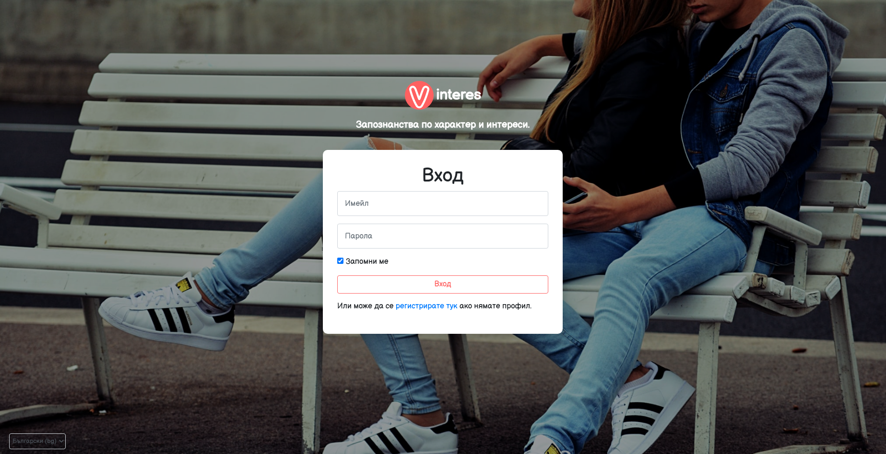
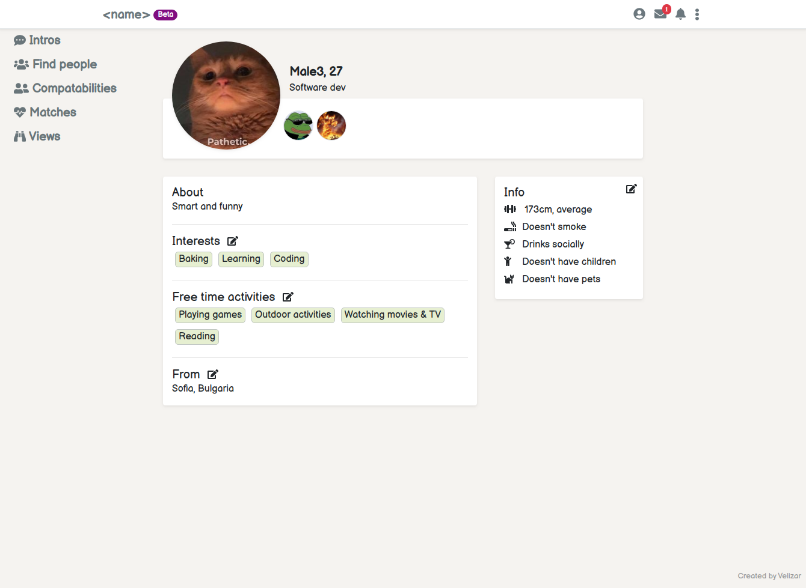
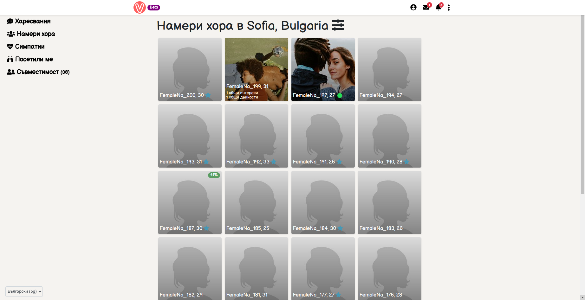
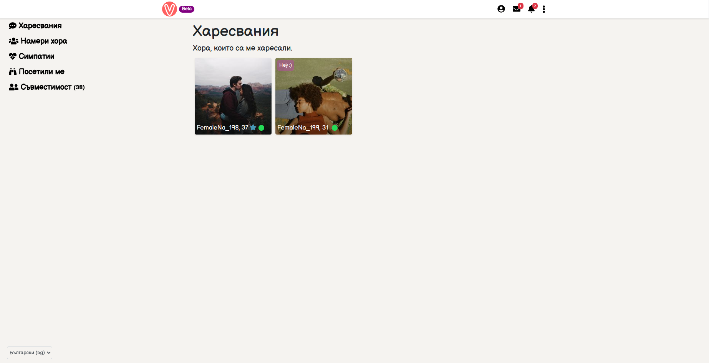
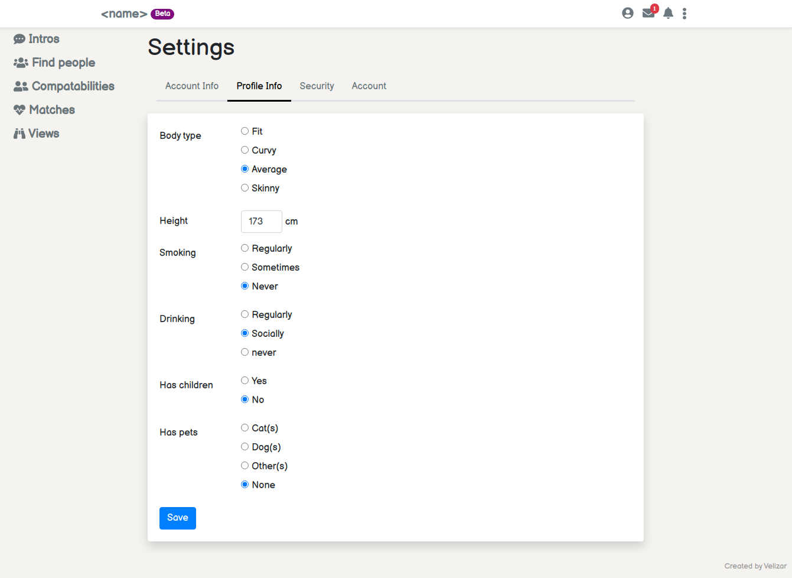
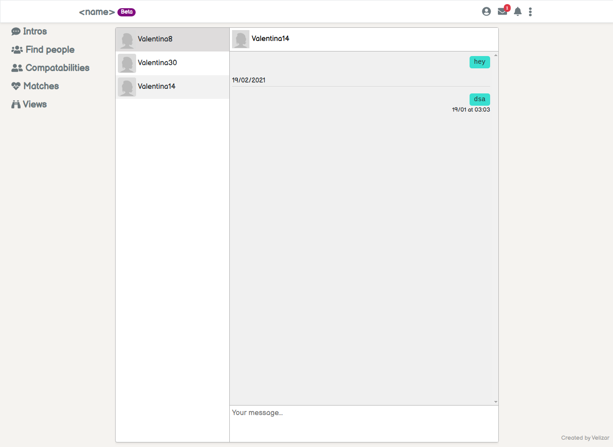

# SPA front-end for Vinteres - Find people by personality and interests.

## Description

Webapp for finding people by personality. When the user signs up he takes a quiz that is used to find better matches. The user can search people by city and age but people with high percentage match will be recomended.

## Features

- Auth
    - login
    - logout
    - sign up. At sign up user takes a personality quiz used to find better matches. At the moment the quiz is not complete.
- Update profile info:
    - name
    - age (Calculated from bithday)
    - title (job, education etc), about, height, smoking & drinking status, does the user have children or pets etc.
    - interests & activities list
    - set current city
    - change password
    - deactivate account
- Like people and send optional message on like.
- Match with other people. The match happens after after you have liked someone that has liked you too.
- See who viewed your profile
- See your mathces
- Upload photos (up to 6). The first photo is your profile picture. You can delete any of them or replace them with another. If you delete or replace the first image then the profile image is changed also. For dev the images are stored in `~/uploads` and for production usage - on AWS S3
- See people with high compatibility percentage to you
- See how many initerests and activities you have in common with every user you see
- Real time notifications. You receive a notification when:
    - receive an intro
    - a match happens
    - someone views your profile
- Real time chat
- Report people. Select a reason (Inappropriate content, Abusive language, Running a scam, Fake profile/photos, Underage, Other) and provide some text details.
- Send general feedback. Select a reason (found a bug, new feature idea, other) and provide some text details.
- User suspension. When a user is suspended you cannon login with his account (sees suspended page), cannot chat with the user and the
  user cannot be found in any listing or profile page

## Screenshots

### Login page:

### Profile page:

### Find people page:

### Likes page (intros sent to me):

### Settings page:

### Chat page:

## Build and run the project

 - `npm install` to install project dependencies.
 - `npm run start` to run the project. Access the project on [http://localhost:4200](http://localhost:4200)